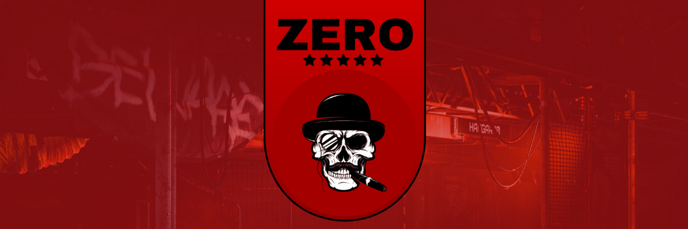

# ZERO Kill Console for Star Citizen

A sleek and efficient kill tracking overlay for Star Citizen, designed to enhance your gaming experience by keep track of your combat statistics in real-time.



## Features

- Real-time kill tracking overlay
- Multiple theme support with customizable header images
- Lightweight and non-intrusive interface
- Built with modern web technologies (Svelte + Electron)
- Easy to install and use

## Installation

### Prerequisites

- Node.js (v16 or later)
- npm (comes with Node.js)
- Star Citizen (obviously!)

### Setup

1. Clone this repository:
   ```bash
   git clone https://github.com/yourusername/killconsole-sc.git
   cd killconsole-sc
   ```

2. Install dependencies:
   ```bash
   npm install
   ```

### Running in Development Mode

To run the application in development mode:

```bash
npm run display
```

This will start both the Vite development server and Electron app.

## Building for Production

To create a production build:

```bash
npm run electron:build
```

The built application will be available in the `dist` directory.

## Usage

1. Launch Star Citizen
2. Run the ZERO Kill Console application
3. The overlay will appear in-game
4. Kills will be automatically tracked and displayed

## Customization

You can customize the appearance by:
- Changing the header images in `src/assets/`
- Modifying the styles in the Svelte components
- Adjusting the overlay position in the application settings

## Contributing

Contributions are welcome! Please feel free to submit a Pull Request.

1. Fork the repository
2. Create your feature branch (`git checkout -b feature/AmazingFeature`)
3. Commit your changes (`git commit -m 'Add some AmazingFeature'`)
4. Push to the branch (`git push origin feature/AmazingFeature`)
5. Open a Pull Request

## License

This project is licensed under the MIT License - see the [LICENSE](LICENSE) file for details.

## Acknowledgments

- Special thanks to the Star Citizen community
- Header images by various artists (check individual image credits in the source code)
- Built with Svelte, Electron, and ❤️